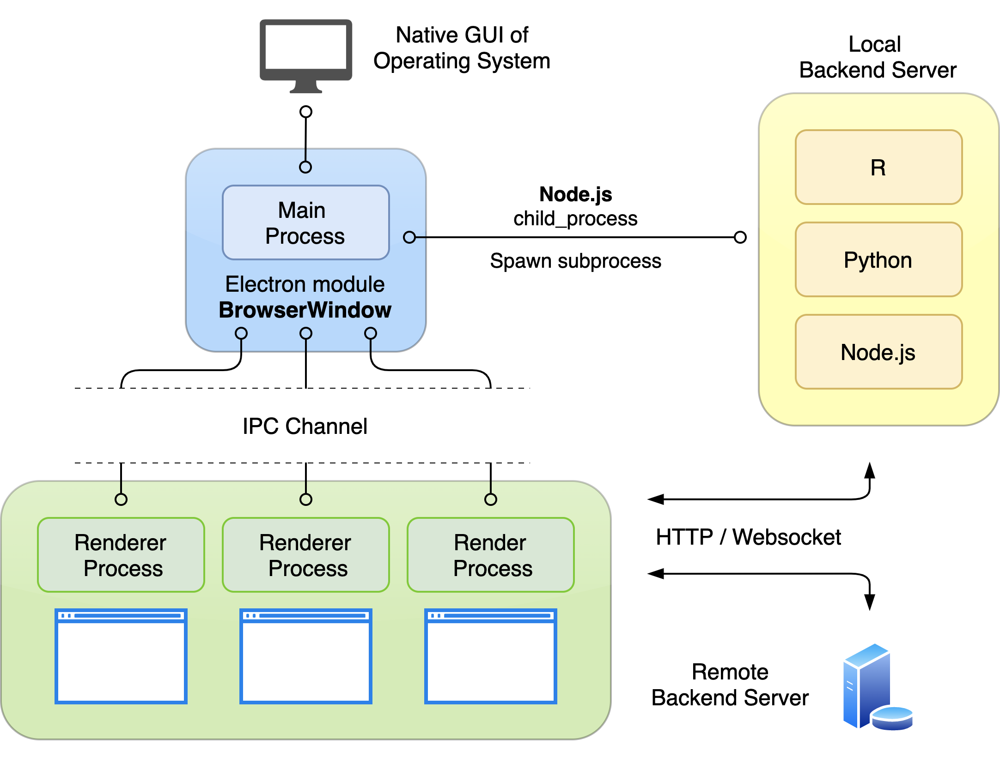

# Something about Electron ...

- Electron is used to build a cross-platform desktop application across different operating system, e.g., MacOS, Window, Linux.
- Because it is powered by Node.js and Chromium, we can just use web-based programming languages (HTML, CSS, and Javascript) to develop an electron app.

# How it works?

---

- Electron app is controlled by two major processes, called **Main** and **Renderer**.
- Main process maintain the overall functionality of the app. Electron provides several modules to perform following tasks:
  - Interact with native APIs, e.g., notification, system menu, tray icons, etc.
  - Create and handle new application window by spawning new renderer process (BrowserWindow module).
- Renderer process consumes HTML, CSS, and Javascript codes to provide user interface.
- Each app has only one main process, but can allow multiple renderer processes (application window) to exist.



# Backend Service

---

- Locally, we can establish a backend service by creating a new subprocess in main process using `child_process` module. The subprocess contains all of the server logic. Later, we should use the websocket connection or HTTP request to exchange the data with the local server.
- Remotely, we can directly send API requests to the remote service as usual website.

# Crosstalk between processes

---

- Electron provides IPC (inter-process communication) channel to exchange message between main process, renderer process, and subprocess.

# Security

---

- The `nodeIntegration` feature enable front-end code (renderer process) to directly access main process module. Functions in these modules have ability to create new process, control native APIs, and permission to access file system, which posing a severe security risk. So, the default setting is turn off since Electron version 5.
- `preload.js` is executed in a **renderer process** and called before all other renderer scripts are loaded in the website. It has full access to Node APIs and the environment of renderer process.
- The global `window` object can be shared between preload script and the renderer process. For security reason, `Context Isolation` should also be **turned on** to prevent sharing the global `window` object (default setting). Using `contextBridge` module to share the variables is a safer way.

  ```jsx
  // preload.js
  // attach a privileged API to window object
  window.myAPI = ipcRenderer.send;

  // front-end javascript code
  // -- contextIsolation disabled --
  window.myAPI; // return API function (risk)

  // -- contextIsolation enabled --
  window.myAPI; // return undefined (safe)
  ```

- `Sandbox` completely isolates the **renderer processes.** It prohibited renderer from accessing most system resources. To perform privileged tasks, electron use IPC to delegate these operation to main processes with higher permission.
- When `Sandbox` is on, preload scripts can only require [limited node modules](https://www.electronjs.org/docs/latest/tutorial/sandbox#preload-scripts), because it is running in the renderer process.

# REF

- Create server with electron app

[https://github.com/jlongster/electron-with-server-example](https://github.com/jlongster/electron-with-server-example)

[https://blog.logrocket.com/advanced-electron-js-architecture/](https://blog.logrocket.com/advanced-electron-js-architecture/)

[https://dzone.com/articles/building-a-desktop-application-with-electron](https://dzone.com/articles/building-a-desktop-application-with-electron)

[https://www.stephanosterburg.com/electron](https://www.stephanosterburg.com/electron)

- Security

[https://www.electronjs.org/docs/tutorial/security](https://www.electronjs.org/docs/tutorial/security#4-enable-sandboxing)
